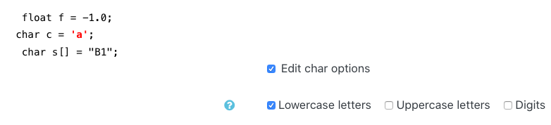

# CodeCPP Moodle Quesiton type (Diploma thesis)
Similar (by difficulty) code question generator for C/C++ codes
The code complexity is based on the [research paper](https://www.researchgate.net/publication/282287438_A_New_Tool_for_Calculation_of_a_New_Source_Code_Metric) 

## How does it work?
1. Teachers can define starting C/C++ code
1. Specify range of different values for operands and operations.

After those steps, the webservice will generate similar variations of the starting code.
Everytime that the question is part of attempt it will have a different variation of it.

## Example:
Let the initial code be:
```c
#include <stdio.h>

int main()
{
    int x=1;
    printf("%d", x);
    return 0;
}
```
And we say that the value for operand `1` can be in the range of `0:10`, we will generate multiple variations where the value for `x` can be in the `[0, 10]` range


## Install steps:
In order for this plugin to be running, you need to install both the moodle plugin and the webservice itself. Multiple moodle sites can use the same webservice (You can define this)

### Moodle plugin:
* **(Recommended)** You can install it either by using the latest release file
* You can copy the `codecpp` folder inside the `MOODLE_ROOT/question/type/`

### Webservice
The dependency steps are mostly the same across all versions.
*Usually* you will have to use the same release version of the webservice and the moodle plugin

##### LLVM APT packages
Add the APT repository for LLVM
```shell script
wget https://apt.llvm.org/llvm.sh
chmod +x llvm.sh
sudo ./llvm.sh 10 # 10 is the <version number>
```

Install packages
```shell script
apt install libllvm-10-ocaml-dev llvm-10-doc llvm-10-examples
apt install clang-tools-10 clang-10-doc libclang-10-dev
apt install python3-pip python3-clang-10 python3-psycopg2 python3-flask
```

(*Optional* but **highly recommended**)
Install virtualenv
```shell script
python3 -m venv codecpp
source codecpp/bin/activate
# You will see (codecpp) before $ in terminal
```

Then install the `requirements.txt`
```shell script
pip3 install -r requirements.txt
```

##### Running the webservice
1. Configure the application in `config.py`. Usually only `WORKING_CODES_DIR` needs to be changed
1. Run the service with `python3 app.py`

## Screenshots
##### Initial code definition


##### Edit ranges


##### Different edit options
`int`


`float`


`char`


`string`


`logical operators`


`binary operators`


`unary operators`


##### Question preview

